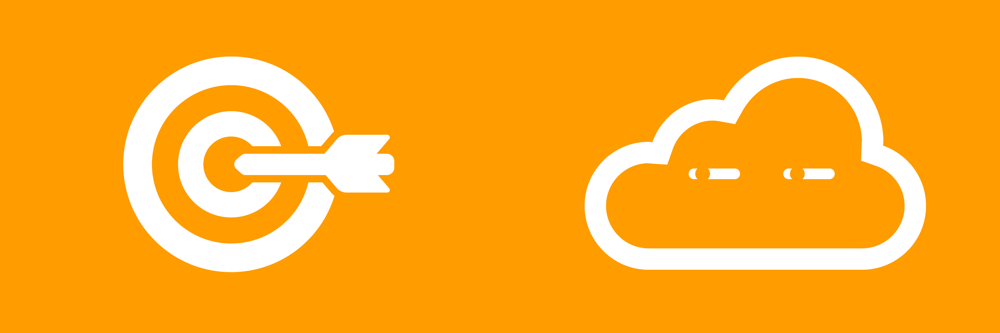
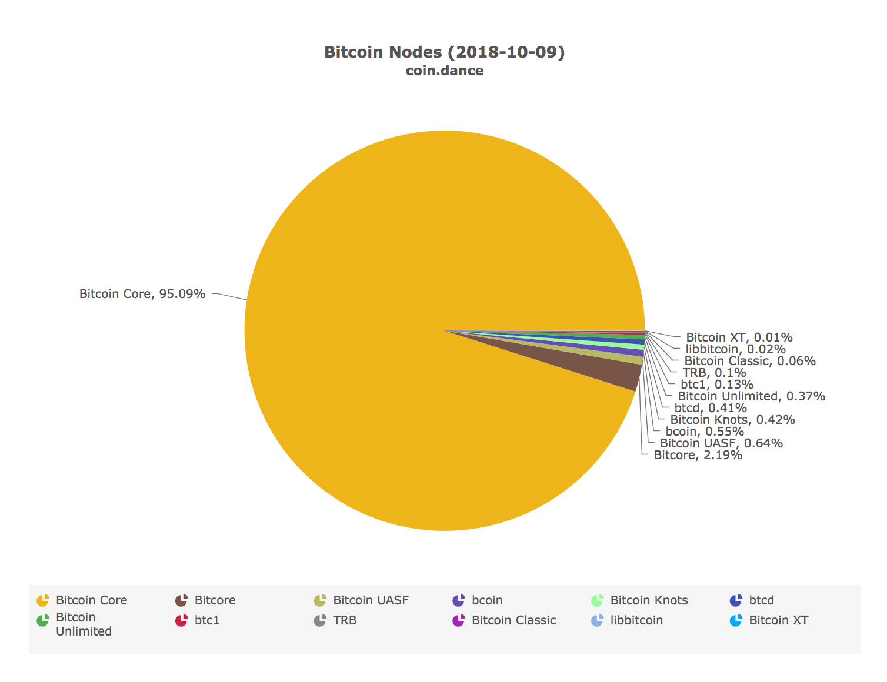

# Nimbus za neznalice

[Nimbus](https://nimbus.status.im) je novi klijent za Ethereumov sljedeći stadij: Serenity. Nimbus je zapravo novi [čvor](https://bitfalls.com/hr/2017/11/26/whats-bitcoin-node-mining-vs-validation/), u neku ruku. Ako ste Ethereum laik i pokušavate doznati što Nimbus jest *upravo sada*, došli ste na pravo mjesto.

O shardingu, skaliranju i svemu drugome što [članak najave](https://blog.status.im/introducing-nimbus-3360367bb311) spominje pričati ćemo u budućim člancima. Ovaj članak napisan je kako bi vas upoznao s onime što Nimbus jest _danas_.

Želimo vam pomoći da razumijete što ovaj alat predstavlja, zašto postoji, i kako pomoći pri njegovom razvoju kako biste zajedno s Nimbus timom pomogli razviti Ethereum 2.0.

## Što je Nimbus sada?


Za pregled onoga što Nimbus _želi_ biti, pogledajte [originalnu objavu](https://blog.status.im/introducing-nimbus-3360367bb311).

Trenutno, u studenom 2018, Nimbus je set alata koji uspješno prolazi neke softverske testove. Softverski testovi su setovi računalnog koda koji se moraju izvršiti bez da jave grešku. Kada se izvrše pomoću Nimbusa, rezultat tih testova ne bi smio biti negativan. Ako svi [ovi testovi](https://ethereum-tests.readthedocs.io/en/latest/) _prođu_ (pass), Nimbus se može smatrati Ethereum klijentom.

Ovako izgleda prekrasni ekran uspješnih testova.


Trenutno Nimbus neće učiniti ništa značajno prilikom pokretanja. Spojiti će se na internet no ne može biti korišten za spajanje na neki [novčanik](https://bitfalls.com/hr/2017/08/31/what-cryptocurrency-wallet/) ili za slanje transakcija. Neće sinkronizirati blockchain ni u _light_ (laganom) ni u _full_ (punom) načinu rada, niti će pokrenuti neko korisničko sučelje.

## Dakle, koji mu je cilj?



Tim trenutno razvija set alata i modula koji će zajedno zadovoljiti uvjete da podrže Ethereum 2.0, poput podrške za sharding ili validaciju putem [Proof of Stake](https://bitfalls.com/hr/2018/04/24/whats-the-difference-between-proof-of-work-pow-proof-of-stake-pos-and-delegated-pos/) sustava. Budući da Ethereum 2.0 mora ostati kompatibilan s Ethereumom 1.0, funckionalnost za 2.0 sadržavati će sve što je potrebno za 1.0. To znači da će Nimbus biti alternativa za [Geth](https://bitfalls.com/hr/2018/02/12/explaining-ethereum-tools-geth-mist/) i Parity kao _full_ čvorove, ali će imati i mogućnost pokretanja u _light_ načinu rada - bez da treba preuzeti cijeli blockchain - i za [_stateless_](https://ethresear.ch/t/the-stateless-client-concept/172) način rada.

Kada će Nimbus biti tehnološki u toku s trenutnim klijentima, tim će krenuti u daljnje implementacije. Budući da je testove koje smo spomenuli prije lakše proći u _full_ načinu rada, Nimbus će vjerojatno prvo biti razvijen kao _full_ čvor, a zatim nadograđen na _light_ način rada.

## Modularnost

Da bi ga se moglo pokrenuti na slabim i _embedded_ uređajima, Nimbus će morati biti iznimno podesiv. Krajnji je cilj podržati sve module na plug-and-play način jednostavnom aktivacijom i deaktivacijom po želji, dok će ti moduli funkcionirati kao pod-programi koji API-jem komuniciraju s Nimbus jezgrom.

Specifično, Nimbus će imati razne verzije. Moći ćete ga kompajlirati (izgraditi) i pokrenuti s posebnim opcijama. Ako ga stavljate na Nokia 3310 telefon, nećete graditi istu verziju kao kada ga stavljate na snažno stolno računalo, niti će to biti ista verzija koja će se koristiti u micro-USB stickovima koje ćete potajno priključiti u "pametne" gradske klupe da biste potajno dodatno decentralizirali mrežu 🕵️‍♂️

I, da, sve ovo će biti moguće s Nimbusom.


Sučelja (poput JSON-RPC ili neko za _embedded Javu_) biti će razvijena za razne operativne sustave na kojima ćemo koristiti Nimbus. Tim se usredotočuje na otvoreni hardver, no ni jedna platforma neće biti zapostavljena. Nimbus će, primjerice, pružati i [EVM-C sučelje](https://github.com/ethereum/evmc) pa će svi klijenti koji koriste isti moći odabrati žele li koristiti Aleth, Geth, ili Nimbus.

Drugi modularni dijelovi biti će i primjerice back-end baza podataka koja se koristi (SQLite vs RocksDB), sustav za pisanje logova (konzola, JSON, txt datoteke, baza podataka), mrežni protokol itd.

## Natječe li se Nimbus s Gethom?

Da i ne. Ethereumova misija je od prvog dana da ima više klijenata radi zdravlja mreže ako se pronađe greška u jednom od njih. Na primjer, greška u Bitcoin Core klijentu oštetiti će cijelu Bitcoin mrežu jer je Bitcoin Core program koji se koristi u [95% slučajeva](https://coin.dance/nodes).



To je neprihvatljivo u Ethereumu, pa se trudimo imati diversificirani skup klijenata. Vodeći su trenutno Geth i Parity [u relativno sličnim postocima](https://www.ethernodes.org/network/1) s ponešto ostalih između njih. Cilj je izgraditi Nimbus do te razine da preuzme barem četvrtinu tog kolača, a kasnije uz druge klijente i manje.

Bitno je napomenuti da s Nimbusom ne pokušavamo smanjiti broj Gethova u mreži ili Paritijevu popularnost. Nimbus je tu da prošiti ekosustav novim uređajima koji sada mogu pokrenuti svoj čvor, a ne da zamijeni trenutne klijente. Kao primjer - Status aplikacija će koristiti Nimbus kada Nimbus bude spreman.

## Izgradnja

Dosta priče, ajmo graditi.

Prije nego počnemo, pretpostavlja se da

- ste [pročitali uvod u Nim](https://bitfalls.com/2018/10/09/introduction-into-the-nim-language/) i imate Nim na sustavu
- koristite sustav poput OS X ili Linux koji je u prijateljskim odnosima s komandnom linijom (Terminal). Ako niste, predlažemo da instalirate neku virtualnu mašinu koja ima sav potrebni softver već instaliran. Primjerice, [Homestead Improved](http://www.sitepoint.com/quick-tip-get-homestead-vagrant-vm-running/) je vrlo dobro rješenje za sve slučajeve u kojima nije potreban ekran, tj. sučelje koje nije tekstualno.

### Instalacije

Da pokrenemo Nimbus prvo moramo instalirati RocksDB bazu podataka i noviju verziju Nima. Na OS X izvršite:

```bash
brew install rocksdb
curl https://nim-lang.org/choosenim/init.sh -sSf | sh
```

Na Linux sustavima, sljedeće bi trebalo biti dovoljno:

```bash
sudo apt-get install librocksdb-dev rocksdb # or your own Linux distribution's equivalent
curl https://nim-lang.org/choosenim/init.sh -sSf | sh
```

Pokretanje `nim --version` trebalo bi sada ispisati nešto slično ovome:

```bash
$ nim --version
Nim Compiler Version 0.19.0 [MacOSX: amd64]
Compiled at 2018-09-26
Copyright (c) 2006-2018 by Andreas Rumpf

git hash: f6c5c636bb1a1f4e1301ae0ba5a8afecef439132
active boot switches: -d:release
```

Nakon toga preuzimamo izvorni kod Nimbusa u mapu u kojoj želimo da naši Nim projekti žive.

```bash
git clone https://github.com/status-im/nimbus
cd nimbus
```

Nim dolazi s vlastitim dodatkom za upravljanje s _dependencies_ (softverom o kojem ovisi) po imenu [Nimble](https://github.com/nim-lang/nimble). To znači da se sve što je Nimbusu potrebno za pokretanje može povući na lokalno računalo naredbom `nimble install`. Ako ste već koristili Nim, možda ćete vidjeti pitanje poput `Prompt: eth_common@1.0.0 already exists. Overwrite? [y/N]` - odgovorite s Y.

_Napominjemo da Nimble sprema sve pakete u zajedničku mapu, pretvarajući ih tako u zajedničke pakete svih vaših projekata. To isto tako znači da ti paketi neće biti vidljivi u projektu u kojem pokrećete `nimble install`. Paketi će biti u `.nimble/pkgs` u mapi vašeg korisnčkog računa. Zašto do toga dolazi i kako to zaobići pogledati ćemo detaljnije u jednom od budućih članaka._

Nakon instalacije, naredba `nimbus` će postati dostupna. Prije nego je pokrenemo, pogledajmo što kaže `nimbus --help`. Ako to radi, pokrenimo `nimble test` - ta naredba pokreće testove koje smo spomenuli gore.

```bash
nimble test
```

Ako sve prođe kako treba, ekran bi trebao vrištati zelene `[OK]`-ove.


Nimbus možete pokrenuti pomoću naredbe `nimbus`. Potražiti će neke čvorove i održati vezu s njima. Pokušati će se i sinkronizirati s blockchainom no zbog greške prilikom sinkronizacije kod bloka koji još ne zna obraditi stati će s radom. To je trenutni doseg Nimbus klijenta.

---

Čestitamo! Uspješno ste izgradili i pokrenuli Nimbus, donekle. U budućim člancima raščlaniti ćemo neke testove, pogledati kako najlakše pridonijeti Nimbusu, uroniti u Nim jezik i još mnogo toga.